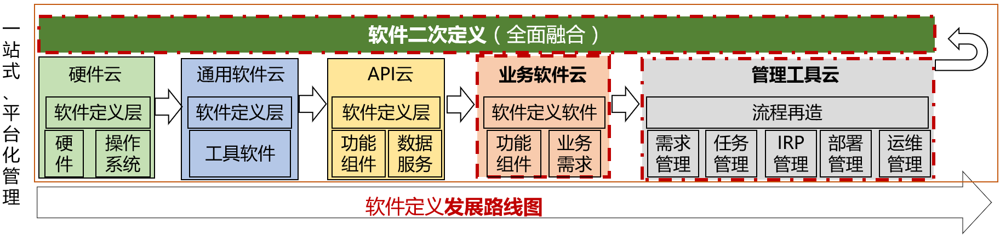

# Block Lang

Block Lang 处在热火朝天、天马行空的开发中，不适合在生产环境使用。如果您有一睹 Block Lang 芳容的冲动，请移步[演示站点 https://blocklang.com](https://blocklang.com)。

## 相信

> **老少皆宜**：每个人都可按照自己的需求，拼装出称心的软件。

## 理念

BlockLang 致力于打造一朵“百花齐放、百鸟争鸣”的软件云，实现软件定义软件。

## 定位

Block Lang 是一个：

1. 可视化的软件拼装工厂，致力于提高软件研发、运维的效率和质量；
2. 组件商店，提供功能全面、质量上乘、持续优化的组件和软件。

## 原理

BlockLang 认为：

1. 一切通用功能都可封装成组件；
2. 一切业务逻辑都可用组件拼装；
3. 软件生产过程应该所见即所得。

BlockLang 将软件开发拆分为两部分：

1. 一是通用组件的研发；
2. 二是基于通用组件拼装出满足业务的软件。

最终实现硬件、软件和生产过程一站式、全面云化。

## 贡献

在提交代码前，请先了解[为什么要开发 Block Lang](./docs/help/why.md) 以及[设计细节](./doc/program.md)。

诚邀志同道合的编程**手艺人**加入（QQ群 `619312757`）。