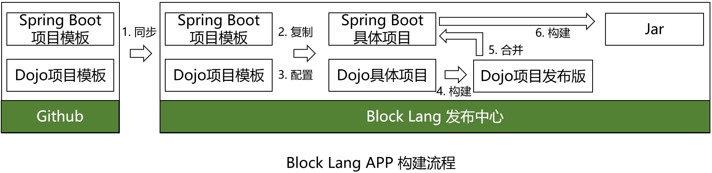

# Block Lang App 构建流程



## 术语

1. 一个 `Block Lang APP` 由通用的项目模板和项目专有的配置数据和代码组成，即 APP = 项目模板 + 配置数据和代码
2. `项目模板` - 指 Block Lang APP 项目的通用基础代码，分为后端的 Spring Boot 项目模板和前段的 Dojo 项目模板，会包含基础的开发套件
3. 项目模板托管在 [blocklang-template](https://github.com/blocklang/blocklang-template) 中，所有对模板代码的修改或升级，都必须修改此仓库中的代码，其他地方则不能修改，只能使用
4. github 上的代码只能在 feature 分支上修改，然后合并到 develop 分支，只有在正式发布时才合并到 master 分支；而 Block Lang 发布中心只能使用已发布的版本，即用 tag 标注过的版本
5. `项目相关的配置`包括生成 json 数据、代码文件、数据库 liquibase 脚本以及程序描述模型等

## 流程

1. **同步** - 在 Block Lang 发布中心会缓存一份项目模板，需与 github 上的代码保持同步
2. **复制** - 在构建具体项目时，需要先为每个项目复制一份项目模板作为基础代码
3. **配置** - 在项目的模板上加入项目特有的配置信息
4. **构建 Dojo 项目** - 在配置好后，对 Dojo 项目执行 build 操作，生成经过优化和压缩的发布版
5. **合并** - 将 build 的 Dojo 发布代码合并都 Spring Boot 的 static 文件夹中
6. **构建 maven 项目** - 使用 `mvnw` 命令构建 Spring boot 项目，生成最终分发的 jar 文件

## 目录结构

### 代码文件

```text
根目录
    |--- template
            |--- client
            |--- server
    |--- projects
            |--- {project_name}
                     |--- client
                     |--- server
                     |--- logs
```

1. client 文件夹中存放 dojo 项目
2. server 文件夹中存放 spring boot 项目
3. logs 文件夹中存放发布日志，一次发布一个日志文件

### jar 文件

1. 使用 maven 的目录结构来管理 jar 文件
