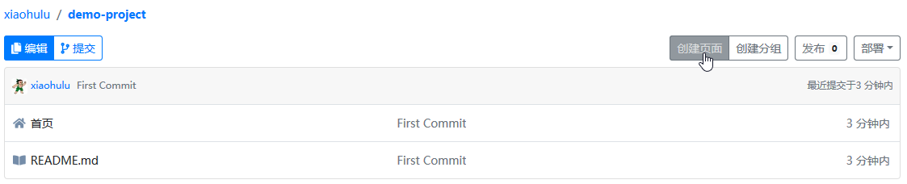
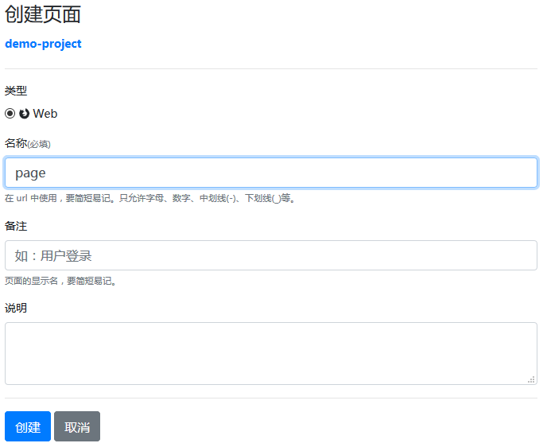
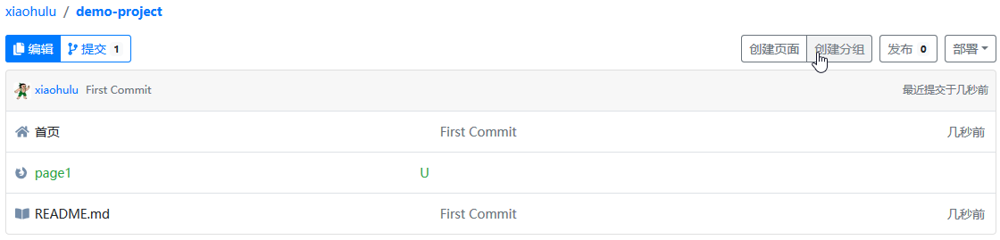
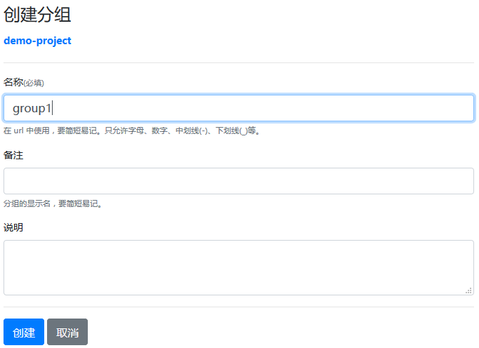
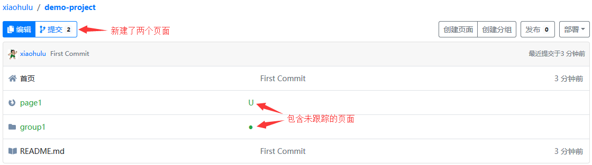
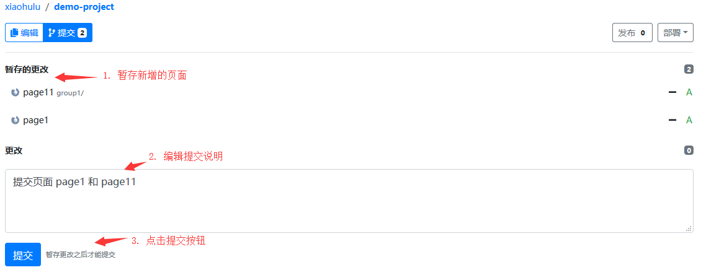
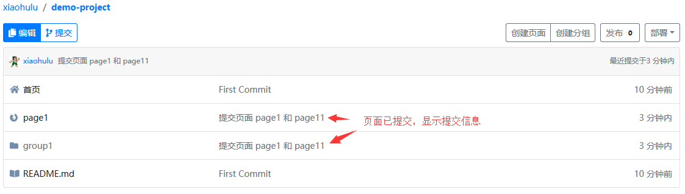

# 2019年5月 (version 0.2.0)

欢迎您了解 Block Lang 0.2.0 发布的功能。此版本增加三个功能：

1. 在项目中创建空页面
2. 在项目中创建分组
3. 使用版本控制系统管理新创建的页面

## 创建空页面

页面，等同 web 项目中的网页，或小程序中的页面，其中包含页面布局、页面样式和页面交互逻辑。

1. 点击【项目首页】右上角的【创建页面】按钮，会跳转到【创建页面】页面

   

2. 在【创建页面】页面填写“名称”、“备注”等信息

   

3. 点击【创建】按钮，页面创建完成并跳转到【项目首页】
4. 完成

## 创建分组

分组，用于对页面等资源进行分组管理。

1. 点击【项目首页】右上角的【创建分组】按钮，会跳转到【创建分组】页面

   

2. 在【创建分组】页面填写“名称”、“备注”等信息

   

3. 点击【创建】按钮，分组创建完成并跳转到【项目首页】
4. 完成

## 提交新创建的页面

在多人协作时，需要使用版本控制系统（git）跟踪项目内容的变更。Block Lang 中使用【提交】功能管理页面等项目资源的变更。

1. 项目中的内容变化后，会用绿色字和字母 U 标识未跟踪的页面，用黄色字和字母 M 标识修改的页面

   

2. 点击【项目首页】左上角的【提交】按钮，切换到提交视图，其中罗列了两个新增页面

   

3. 点击【更改】区域中未跟踪页面后的【+】，暂存页面，然后填写提交信息，并点击【提交】按钮

   

4. 提交成功后，【项目首页】会显示最新的提交信息

   

5. 完成

## 社区

一如既往的诚邀志同道合的编程手艺人加入（QQ群 `619312757`）。