# 2019年7月 (version 0.3.0)

Block Lang 0.3.0 引入一个新概念：组件市场。

拼装软件时使用的零部件统称为组件。所有组件在组件市场中统一管理，包括 Block Lang 的内置组件。

组件市场包含三个子概念：

* **组件** - 是项目的最小组成单位，是业务无关、高内聚的一类通用功能；
* **API 仓库** - 是一个 git 仓库，存储一组相关组件的接口规范；
* **组件仓库** - 是一个 git 仓库，存储一组相关组件的实现代码。

API 仓库与组件仓库的关系：

* 遵循接口与实现隔离，面向接口拼装的原则；
* API 仓库专用于定义接口规范；
* 组件仓库专用于存储实现代码；
* 一个组件仓库必须实现一个 API 仓库；
* 一个 API 仓库支持 N 个组件仓库（推荐）。

在组件市场中**直接**发布的对象是组件仓库，但会发布两个仓库：

1. 组件仓库 - 下载并编译组件仓库
2. API 仓库 - 定位到组件仓库实现的 API 仓库，并存储接口规范

## API 仓库

API 仓库是一个 git 仓库，专用于定义接口规范。参见 [API 仓库示例](https://github.com/blocklang/api-widgets-bootstrap)，定义了一套 UI 部件的接口规范。

注意，git 仓库可以托管在 [github](https://github.com/)、[码云](https://gitee.com/)或者部署在局域网内的 gitlab 等源代码托管软件上。

### API 仓库描述文件

在 API 仓库根目录下定义一个名为 `api.json` 的描述文件，见下图

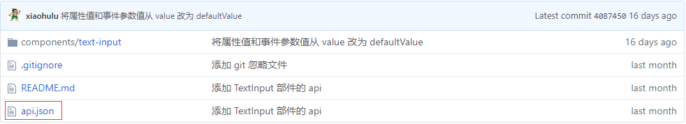

`api.json` 中包含仓库的名称(`name`)、版本号(`version`)、友好的显示名(`displayName`)、仓库的详细说明(`description`)、部件分类(`category`) 和定义的组件列表(`components`)等信息，见下图

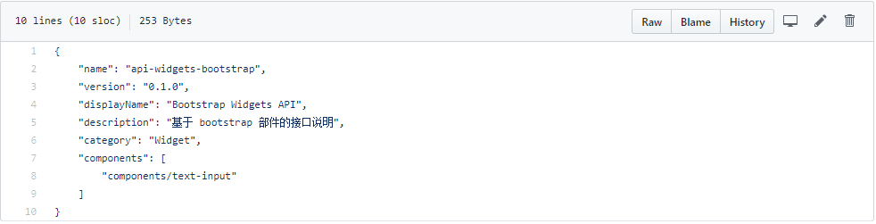

### API 变更文件

在 API 仓库中定义的不是 API 快照，而是借鉴 [liquibase](http://www.liquibase.org/) 中的 changelog 概念，用增量的形式记录 API 的每一次变更。

约定一个 changelog 文件对应一个版本（即 git 中的一个 tag）。如在 0.1.0 版本中 `text-input` API 的变更都存在 `0_1_0.json` 文件中。见下图

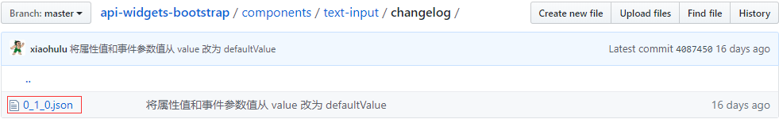

一个 Change Log 文件中包含一到多个变化，在 Block Lang 0.3.0 版本中仅支持 `newWidget` 操作（变化），下图展示了新增 `TextInput` 部件的 API 变更说明片段。

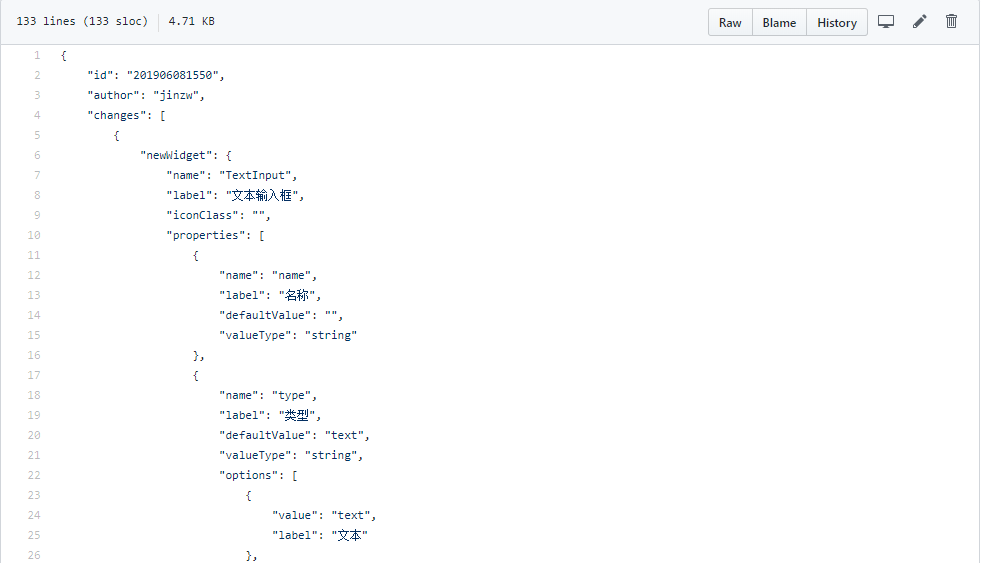

## 组件仓库

组件仓库是一个 git 仓库，专用于存储实现代码。参见 [组件仓库示例](https://github.com/blocklang/widgets-bootstrap)，使用 dojo 和 bootstrap 实现的 UI 部件，实现了 [API 仓库示例](https://github.com/blocklang/api-widgets-bootstrap)。

### 组件仓库描述文件

在组件仓库的根目录下定义一个名为 `component.json` 的描述文件，见下图

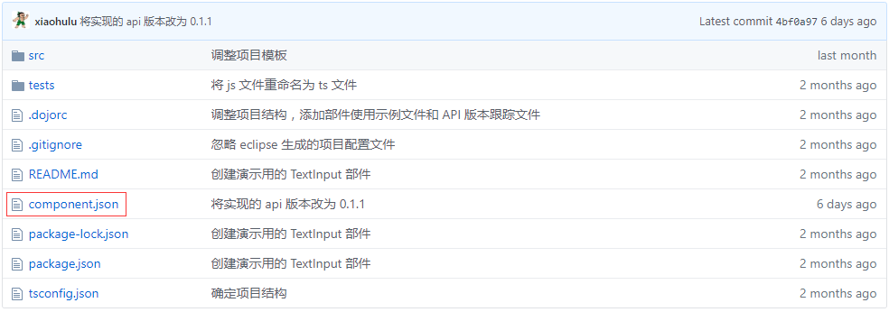

`component.json` 中包含仓库的名称(`name`)、版本号(`version`)、友好的显示名(`displayName`)、仓库的详细说明(`description`)、部件分类(`category`)、使用的编程语言(`language`)和定义的组件列表(`components`)等信息，还包括一个 `api` 属性，它用于指定本仓库实现的 API 仓库的地址和版本号。

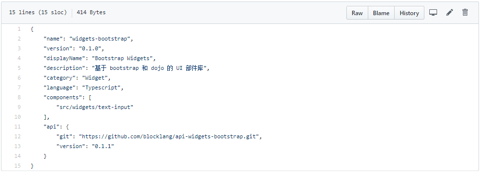

### 实现代码

在架构的设计上，是完全支持任何一门编程语言的。但截止 0.3.0 版本，重点支持用 TypeScript 语言和 Dojo 框架编写前端实现；用 Java 语言和 Spring boot 框架编写后端实现。

以下是用 TypeScript 语言和 Dojo 框架实现的 `TextInput` 部件，代码存在 `index.ts` 文件中

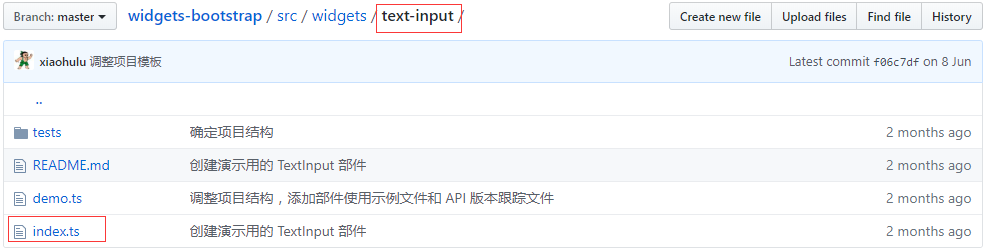

## 发布组件仓库

当在源代码托管平台(如 github)上发布完 API 仓库和组件仓库后，就可在 Block Lang 的组件市场中发布组件仓库，以供 Block Lang 中的项目使用。

1. 在网页的菜单栏左侧点击【市场】超链接，会跳转到全局的【组件市场】页面

   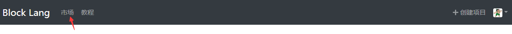

2. 点击全局【组件市场】页面右上角的【发布组件】按钮，会跳转到用户级别的【组件市场】页面

   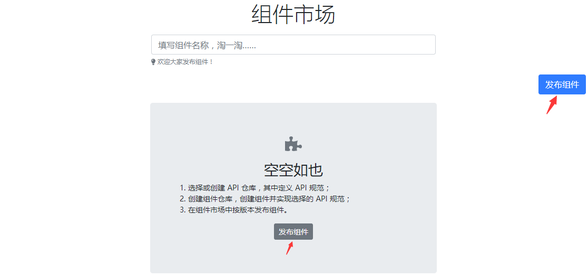

3. 填写组件仓库的 HTTPS 地址，然后点击【发布】按钮，开始发布后会跳转到【发布日志】页面

   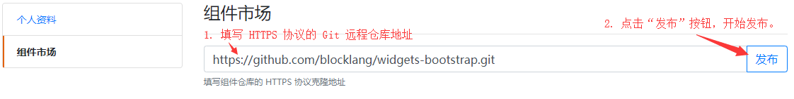

4. 在【发布日志】页面，会显示详细的发布日志，可通过发布日志定位发布错误的原因

   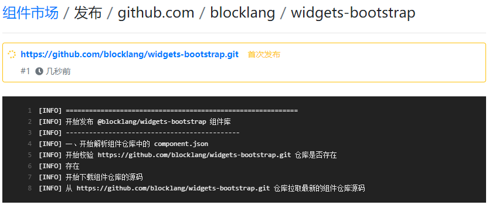

5. 发布成功后，可在【我的组件市场】和【公共组件市场】看到已发布的组件

   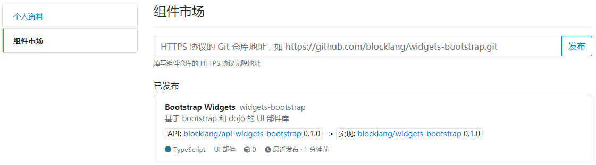
   或
   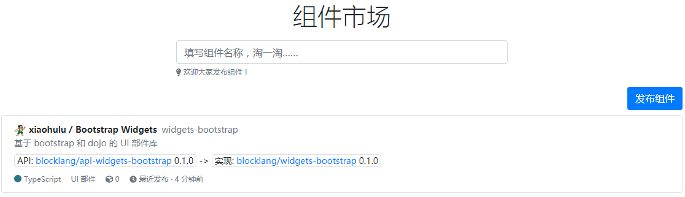

6. 完成。

组件库发布完成后，可在 Block Lang 项目中使用组件库。

## 在项目中使用组件仓库

在 Block Lang 项目的根目录添加一个名为 `DEPENDENCE.json` 文件，其中配置项目依赖的组件仓库。该功能将在 0.4.0 版本中实现。

## 社区

一如既往的诚邀志同道合的编程手艺人加入（QQ群 `619312757`），共建 Block Lang 软件研发社区。
