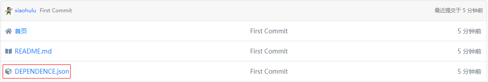
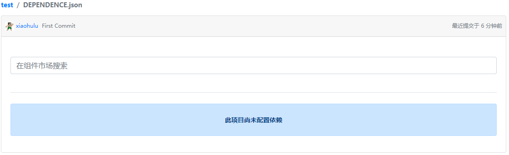
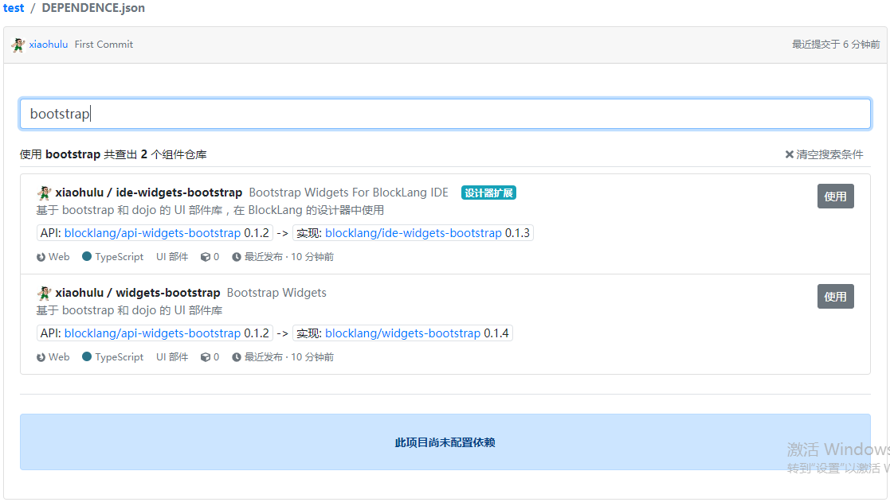
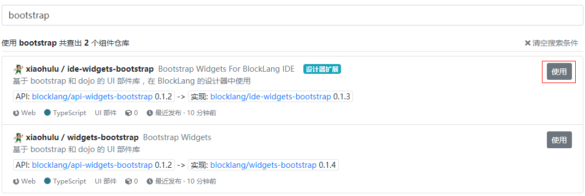
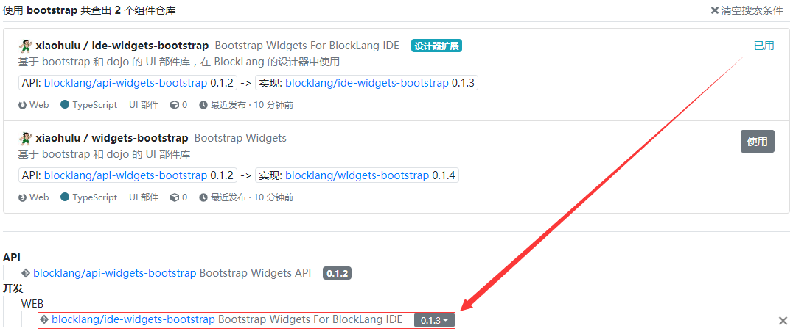
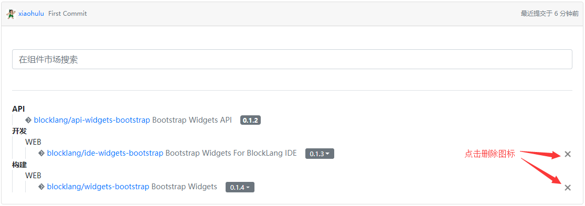
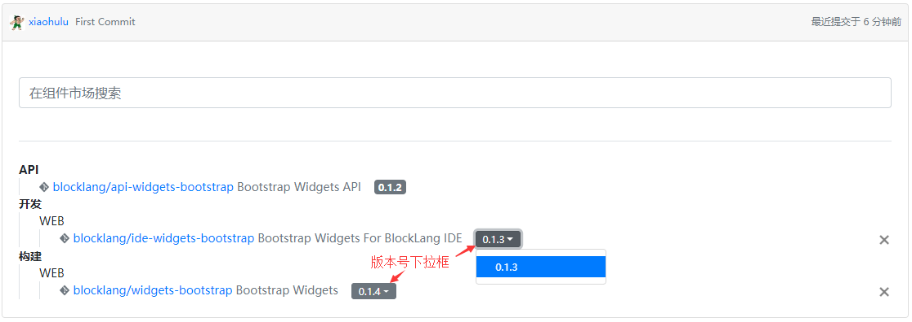

# 2019年8月 (version 0.4.0)

犹如 Java 语言的 Maven，JavaScript 语言的 npmJs，Rust 语言的 Cargo 等依赖管理工具，Block Lang 0.4.0 版本也引入依赖管理功能。

Block Lang 项目依赖的对象是组件市场中注册的组件仓库。在组件市场时，我们称之为“组件仓库”；跟项目关联后，我们称之为“依赖”。

0.4.0 版本引入的依赖管理包括以下四个功能点：

1. 创建依赖配置文件；
2. 添加一个依赖；
3. 删除一个依赖；
4. 更新依赖版本。

## 依赖配置文件

Block Lang 项目的依赖统一配置在位于项目根目录下的 `DEPENDENCE.json` 文件中。

依赖分为三大类：

1. **API** - 对应 API 仓库
2. **开发** - 组件仓库，在开发阶段使用，是 Block Lang 设计器的扩展
3. **构建** - 组件仓库，在构建阶段使用，支持为不同的应用程序配置不同的依赖

`开发` 和 `构建` 下配置的都是组件仓库，而 `API` 下是这些组件仓库对应的 API 仓库，因此无需直接配置。

`开发` 和 `构建` 下的依赖又按应用程序类型分组，如可以为 web 应用和微信小程序分别配置依赖。

用 json 描述的依赖结构大致如下：

```json
{
    "dev": {
        "web":{
            "github/@owner1/repo1": {"git": "https://github.com/owner1/repo1.git", "tag": "v0.1.0"},
            "gitee/@owner2/repo2": {"git": "https://gitee.com/owner2/repo2.git", "tag": "v0.1.0"}
        }
    },
    "build": {
        "web":{
            "default": {
                "github/@owner3/repo3": {"git": "", "tag": "v0.1.0"}
            }
        },
        "wechatMiniApp": {
            "default": {
                "github/@owner4/repo4": {"git": "", "tag": "v0.1.0"}
            }
        }
    }
}
```

注意：`build` 分组下多了一层，名为 `default`，这是为后续版本预留的 Profile 功能。

以上 json 数据仅用于辅助了解 `DEPENDENCE.json` 的结构；妙在，Block Lang 采用可视化的方式配置依赖，无需关注实现细节。

## 创建 `DEPENDENCE.json`

创建项目时，会在项目的根目录下创建 `DEPENDENCE.json` 文件。



## 添加一个依赖

Block Lang 项目的一个依赖就是在组件市场中注册的一个组件仓库，因此添加依赖就是从组件市场中选择组件仓库。

1. 点击 `DEPENDENCE.json` 进入【依赖配置】页面

   

2. 在搜索框中填写检索信息，会根据组件仓库的名称和显示名匹配

   

3. 检索到组件仓库后，点击右侧的“使用”按钮，会在项目中添加此依赖

   

4. 依赖添加完成后，会分层级显示

   

## 删除一个依赖

只有 `开发` 和 `构建` 分组下的依赖才有“删除”功能，正如 API 依赖无需直接添加一样，也无需直接删除 API 依赖。

在【依赖配置】页面，点击“删除”图标，即可删除对应的依赖



## 更新依赖版本

只有 `开发` 和 `构建` 分组下的依赖才有更新依赖版本功能。

在【依赖配置】页面，点击依赖的版本号下拉框，点选其他版本号，就可完成更新



## 下一版

Block Lang 0.5.0 版本将支持设计页面，包括

1. 设计页面外观；
2. 配置页面处理逻辑。

## 社区

一如既往的诚邀志同道合的编程手艺人加入（QQ群 `619312757`），共建 Block Lang 软件研发社区。
