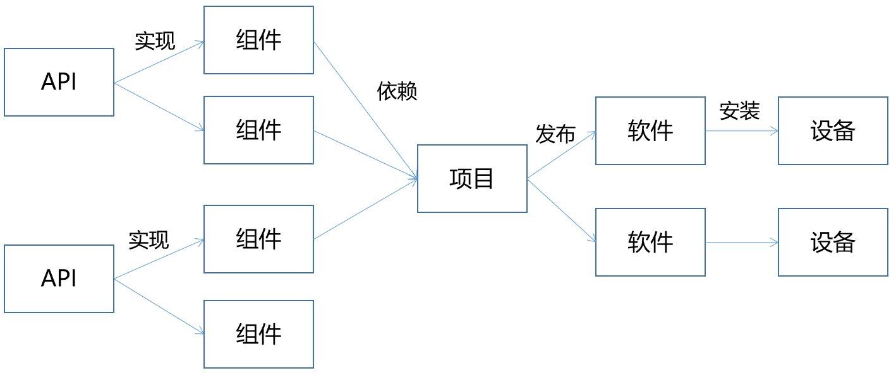
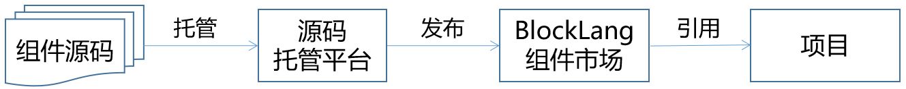

# 组件

组件是可复用的、是对特定功能的封装。我们将 UI 组件称为小部件(Widget)。

在 Block Lang 中，软件是由组件拼装而成的，因此对组件有更严格的规范。

目标：做到在项目中可以无缝切换组件，项目直接依赖于 API，项目不能依赖于组件，而组件实现 API。

## 待解决的问题

1. 支持跨平台，配置一次后，生成的软件可运行在 web 浏览器上，也可运行在 PC 桌面应用中
   1. 只有一套规范
   2. 但有多套实现，如 Dojo、Vue、React 等实现，或 WPF、QT 等实现
2. UI 部件可支持响应式设计
   1. 如果部件不支持响应式设计，则能为不同分辨率配置不同的页面
   2. 如果部件支持响应式设计，则只需配置一套页面
3. 要能编译出多套软件
4. UI 部件和其他组件一样，都遵循相同的模式
5. 必须确保组件、组件的属性、组件的方法等接口的标识，当值确定后，就不能再修改

## 实现方式



如上图所示：

1. 为每个组件定义一个 API 项目，专门描述组件接口；
2. 为每个 API 项目定义多套组件项目，可使用不同的编程语言或组件实现，但必须遵循 API 项目中的规范；
3. 项目依赖多版本组件，包含两类依赖：
   1. dev 依赖，专用于开发过程中；
   2. prod 依赖，专用于软件发布，可支持多套 profile，如可发布为 android 原生应用，也可发布为微信小程序。

项目关系说明

1. API 项目用于描述组件接口规范，在 README.md 文件中详细说明接口规范，在 changelog 文件夹下存储 json 格式的组件接口变更记录
2. 组件项目提供具体的实现，要指明对应的 API 项目，也要说明是否可用作 dev 依赖
3. 在项目的依赖配置中，可指定依赖的范围（scope），包括 dev 和 prod 两种，其中 prod 可指定多个 profile，但必须指定一个名为 `default` 的 profile
4. 在发布时，默认按照 `default` 依赖生成软件，用户也可以指定 profile

## 项目结构

一个组件由两类项目定义：

1. API 项目：用于定义组件接口
2. 组件项目：用于实现组件接口

### API 项目

API 是一个不断借鉴和淘汰的演化过程。所以平台要能管理 API 的不同版本，同时平台提供开发的 API 管理能力，让人人都可以定义 API，然后在使用过程中优胜劣汰。

```text
root
  |--- api.json
  |--- README.md
  |--- components
          |--- {component}
                   |--- README.md
                   |--- changelog
                            |--- 0_1_0.json
                            |--- 0_2_0.json
```

目录结构介绍

1. `api.json` - 存储组件 API 基本信息
2. `README.md` - 组件库介绍
3. `components/` - 存所有组件的 API
   1. `{component}/` - 组件名称，采用小写字母，多个单词用'-'隔开
      1. `README.md` - 存组件 API 的详细定义，只存储最新的信息
      2. `changelog/` - 按版本，存储组件 API 变更记录
         1. `0_1_0.json` - 一个版本对应一个变更文件

#### `api.json`

```json
{
    "name": "",
    "version": "",
    "displayName": "",
    "description": "",
    "category": "Widget",
    "components": [
        "components/button"
    ]
}
```

数据项介绍

1. `name` - 组件库的名称(必填)
2. `version` - 组件库的版本(必填)
3. `displayName` - 组件库的显示名(可选)
4. `description` - 组件库详细介绍(可选)
5. `category` - 组件库种类，当前仅支持 `Widget`(必填)
6. `components` - 数组，存储组件的相对路径
   1. 当 category 为 `Widget` 时，如 Button 部件的 API 存在 `components/button` 文件夹中

#### changelog

一个发行版，记录一次 api 变更。

在变更文件中存储变更操作和变更的接口信息，如部件名称、属性和事件等信息。

UI 部件支持以下命令：

1. `newWidget` - 新增部件
2. `alterWidget` - 修改部件基本信息
3. `addProperty` - 在部件中新增属性
4. `removeProperty` - 移除部件中的属性
5. `alterProperty` - 修改部件中的属性
6. `addEvent`, - 在部件中新增事件
7. `removeEvent` - 移除部件中的事件
8. `alterEvent` - 修改部件中的事件

功能组件支持以下命令：

1. `newComponent` - 新增组件
2. `alterComponent` - 修改组件基本信息

注意：

1. 修改已存在的属性和事件时，要使用 alter 命令，而不是组合使用 remove 和 add 命令
2. 如果组件已经登记，则不允许删除组件（因为可能已被引用），所以增加时要慎重

changlog 的 json 格式

```json
{
    "id": "20190101_button",
    "author": "",
    "changes": [
        {
            "newWidget": {
                "name": "部件名称，一个项目中要唯一",
                "label": "部件显示名",
                "iconClass": "部件图标",
                "appType": ["web"],
                "properties": [{
                    "name": "属性名",
                    "label": "属性显示名",
                    "value": "属性默认值",
                    "valueType": "string | number | boolean | date",
                    "options": [{
                        "value": "选项值",
                        "label": "显示名",
                        "title": "",
                        "iconClass": ""
                    }]
                }],
                "events": [{
                    "name": "onClick",
                    "label": "单击事件",
                    "valueType": "function",
                    "arguments": [{
                        "name": "参数名",
                        "label": "显示名",
                        "value": "默认值",
                        "valueType": "string | number | boolean | date"
                    }]
                }]
            }
        }
    ]
}
```

注意：**要能跟踪部件名、属性名、事件名等，当给定唯一标识后，不能再变更此标识**

### 组件项目

#### UI 部件

设计目标：能集成开源社区的设计语言，如 ant.design，google material 等。

为了实现层面的统一，需要使用 dojo 实现 ant.design 等，但要充分复用样式等。

存放 UI 部件的目录结构为（以 Button 部件为例）：

UI 部件又包含两种：

1. 一种是在开发模式下，设计器中使用的部件
2. 一种是在生产模式下，渲染界面时使用的部件

这两种项目的结构类似，都为

```text
root
  |--- src
        |--- widgets
                |--- button
                       |--- index.ts
                       |--- demo.ts
                       |--- tests
                              |--- functional
                                      |--- Button.ts
                              |--- unit
                                      |--- Button.ts
        |--- themes
                |--- bootstrap
                       |--- button.m.css
                       |--- button.m.css.d.ts
  |--- component.json
```

目录结构介绍

1. `component.json` - 存储组件基本信息
2. `src/widgets/` - 存 ui 部件，一个部件对应一个文件夹，文件夹名小写
3. `src/widgets/{button}/`
   1. `index.ts` - 部件类
   2. `demo.ts` - 部件使用效果示例，集成到设计器中、
   3. `test/` - 存放单元测试和功能测试、
4. `src/themes/` - 存放样式主题，一个文件夹对应一个主题

`component.json`

```json
{
    "name": "",
    "version": "",
    "displayName": "",
    "description": "",
    "category": "Widget",
    "language": "Typescript",
    "components": [
        "src/widgets/button"
    ],
    "api": {
        "git": "",
        "version": ""
    },
    "dev": true
}
```

数据项介绍

1. `name` - 组件库的名称(必填)
2. `version` - 组件库的版本(必填)
3. `displayName` - 组件库的显示名(可选)
4. `description` - 组件库详细介绍(可选)
5. `icon` - 组件库 logo 的存放路径(可选)
6. `category` - 组件库种类，当前仅支持 `Widget`(必填)
7. `language` - 开发语言，当前支持 `Typescript`(必填)
8. `components` - 数组，存储 widget 的相对路径，如果 `Button` 部件类在 `src/widgets/button/index.ts` 文件中，则相对路径为 `src/widgets/button`
9. `api` - 表示此仓库实现的是哪个 api 项目
   1. `git` - git 仓库地址
   2. `version` - 版本号
10. `dev` 是否能用户开发模式，如果项目仅用于开发模式下，则将 `dev` 的值设置为 `true`，默认为 `false`。

注意：

1. 部件的存储路径是有约定的，本可以根据约定自动查找，但这里增加 `components` 参数，让组件库开发人员显式指定。这样就增加一个人为干预的手段。
2. 当 UI 部件的 `dev` 为 `true` 时，表示存储的是设计器版部件类，在对应的部件上增加设计器特性。

数据项校验规则

1. name
   1. 不能为空
   2. 长度不能超过64个字节
   3. 只能包含字母、数字、中划线和下划线
   4. 同一个发布者没有发不过此名称的组件库
2. version
   1. 不能为空
   2. 必须是有效的语义化版本
   3. 必须大于最新的版本号
3. category
   1. 不能为空
   2. 只能是 “Widget”（不区分大小写）
4. language
   1. 不能为空
   2. 只能是“Typescript”或“Java”（不区分大小写）
5. description
   1. 长度不能超过512个字节
6. icon
   1. 长度不能超过64个字节
7. api.git
   1. 不能为空
   2. 有效的 https 协议的 git 远程仓库地址
   3. 根据此地址能找到远程仓库
8. api.version
   1. 不能为空
   2. 有效的语义化版本号

UI 部件项目命名

拟支持的 UI 库，不限于此。

1. widgets-bootstrap - 基于 bootstrap
2. widgets-antd - 基于阿里巴巴蚂蚁金服的 ant design
3. widgets-fusion - 基于阿里巴巴的 fusion design
4. widgets-google-material - 基于 google material (dojo 官方提供)
5. widgets-wechat - 微信小程序版

### 功能组件

## 管理方式

API 和组件源码可托管在基于 git 的源代码托管网站，如 github 或码云等。但在 BlockLang 平台中使用组件时，必须先将这些组件发布到 BlockLang 的组件市场，然后项目直接引用组件市场中的组件。关系如下图：



### 人工审核

为了充分发挥出 API 项目将业务项目与实现隔离的优势，以便在 API 稳定的前提下能无缝切换实现，就必须确保 API 项目具备普适的特性。要重点避免出现为一套实现定制一套 API 的情况，这样 API 项目就没有存在的价值了。

因此当往组件市场中发布时，要加入人工审核环节，以控制 API 项目的数量，如果发现已存在类似的 API，则建议作者为已存在的 API 项目做贡献，除非他提供的 API 更加丰富。

如何处理：

1. 为了不给大家的积极性设置任何约束，不强行限制大家发布 API 库，但是用户会对 API 库进行点评
2. 审核人员的审核依据：解决同一类业务、被标注为优质的 API 库，不能超过 10 个
3. 一个 API 项目的实现库越多，这套 API 项目就越优质
