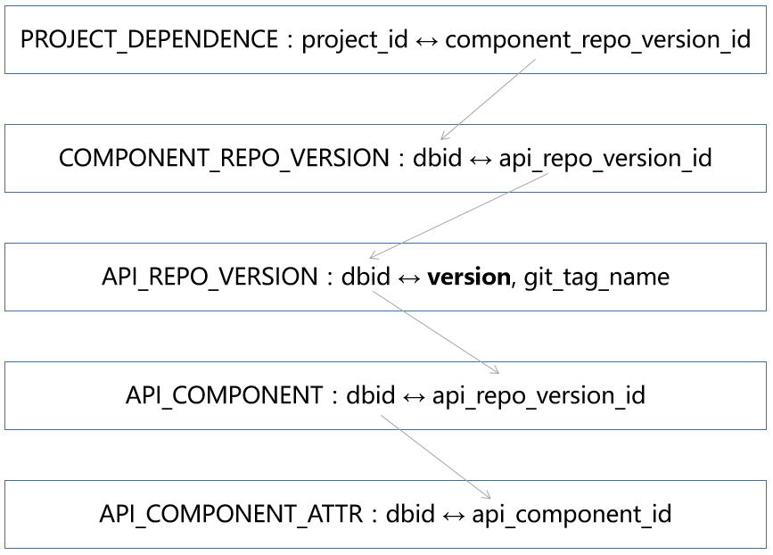

# 项目的依赖

犹如 Maven 项目在 `pom.xml` 中定义依赖，JavaScript 项目在 `package.json` 中定义依赖，BlockLang 项目则在 `dependence.json` 中定义项目的依赖。

每一个 BlockLang 项目的根目录下，都有一个用于定义项目依赖的 `dependence.json` 文件。

项目依赖的对象是在组件市场中注册的组件库。

## 依赖的分类

项目的依赖分三大类：

1. API - 依赖的 API 项目，用于定义接口规范；
2. Dev - 集成到设计器(IDE)中的组件项目；
3. Build - 与发布相关的组件项目。

其中 Dev 和 Build 组件项目都要实现 API 项目。

Dev 组件项目是为了能在设计器中实时看到设计效果，就需要提供以下两类组件：

1. 设计器专用的 UI 部件；
2. 为 UI 部件和功能组件设置属性的属性面板。

Build 中提供的 UI 部件，在 Dev 中也会提供一份，同时 Dev 提供的 UI 部件增加了与设计器交互的相关功能。

注意，在添加依赖时，需要按以下规则校验：

1. **在一个项目中，一套 API 对应的 Dev 版依赖只能有一个**，如果一套 API 出现多套 Dev 依赖，则就需要选择在设计器中使用哪一套 Dev 依赖；
1. **在一个项目中，一套 API 对应的一个 Profile 中的 Build 版依赖只能有一个**。

## 依赖的层级

要描述一个依赖，需要提供以下三层信息：

1. 第一层是运行环境；
2. 第二层是编程语言；
3. 第三层是开发框架。

API 是接口项目，只与第一层的运行环境有关，第二层的编程语言和第三层的开发框架都是实现层面的概念，因此与 API 无关。Dev 是为了与 BlockLang 的几个设计器集成的，使用的编程语言和开发框架需要与设计器保持一致，所以 Dev 与第一层的运行环境有关，第二层的编程语言和第三层的开发框架分别默认使用 TypeScript 语言的 Dojo 框架和 Java 语言的 Spring Boot 框架。而为了做到跨平台、跨语言和跨框架，需要在 Build 中做好三个层级的配置。

### 运行环境

BlokLang 的跨平台是通过提供不同的运行环境，通过指定页面解析引擎或代码生成实现的。

常见的运行环境包括：

1. 浏览器
2. android
3. ios
4. 微信
5. 支付宝
6. 快应用
7. JVM
8. 操作系统：Windows、Linux 和 iOS

程序类型(AppType)与运行环境的对应关系：

1. web -> 浏览器
2. android -> android
3. iOS -> iOS
4. 微信小程序 -> 微信 APP
5. 支付宝小程序 -> 支付宝 APP
6. 快应用 -> 快应用
7. React-Native -> android/iOS
8. Google Flutter -> android/iOS/浏览器

程序类型的定义侧重于 UI 层，还有一个数据服务，对应的运行环境可以为 JVM 等虚拟机。

所以支持发布到多种设备，就是一种跨平台的实现方式。

### 编程语言

不同的程序类型，能使用的编程语言和开发框架是有一定的限制的。

下面我们逐个分析每一个程序类型能使用的编程语言和开发框架：

1. web - 单页面应用使用的编程语言主要是 HTML5、CSS 和 JavaScript/TypeScript，常用的框架主要是 React、Vue、Angular、Dojo 等；
2. 微信小程序/公众号、支付宝小程序、快应用使用的编程语言主要是 HTML5、CSS 和 JavaScript/TypeScript，主要是各小程序自带的框架；
3. Android - 编程语言是 Java 和 Kotlin
4. iOS - 编程语言是 Swift
5. PC 应用可支持的编程语言是 Java、C#、C++、Rust、Go 等
6. 数据服务使用的编程语言是 Java、Python、Ruby、Rust、Go 等

### 开发框架

即便是同一种运行环境下同一个编程语言，针对同一个功能，也有很多开发框架，如 Struts 和 Spring MVC。开发框架在这里更多的是指不同的实现，不一定要对应上一个社区有影响力的开源框架。

通过这三个层级，就可以定义出一个发布任务，如发布一个依赖 XX 编程语言的 XX 开发框架的 web 客户端。这样就可以在一个项目的 Build 中配置多套发布 profile。

### 依赖图谱



## `dependence.json`

虽然有三个层级，但可将编程语言和开发框架统称为 profile，实际包含两个层级。

```json
{
    "dev": {
        "web":{
            "github/@publisher1/repoName1": {"git": "", "tag": "v0.1.0"},
            "gitee/@publisher2/repoName2": {"git": "", "tag": "v0.1.0"}
        }
    },
    "build": {
        "web":{
            "default": {
                "github/@publisher1/repoName1": {"git": "", "tag": "v0.1.0"},
                "github/@publisher2/repoName2": {"git": "", "tag": "v0.1.0"}
            },
            "profile2": {
                "github/@publisher11/repoName11": {"git": "", "tag": "v0.1.0"},
                "github/@publisher22/repoName22": {"git": "", "tag": "v0.1.0"}
            }
        },
        "weapp": {
            "default": {
                "github/@publisher3/repoName3": {"git": "", "tag": "v0.1.0"},
                "github/@publisher4/repoName4": {"git": "", "tag": "v0.1.0"}
            }
        },
        "alipay": {

        },
        "swan": {

        }
    }
}
```

小程序支持：微信小程序 weapp、百度小程序 swan、支付宝小程序 alipay、子节跳动小程序 tt、QQ 小程序 qq、京东小程序 jd、快应用等。也可以将小程序发布为 H5 应用、Android 和 iOS app 等。在项目配置页面设置每个项目要发布的类型。

为每个运行环境，添加一个默认的 profile，名称为 `default`。

将组件库归到哪个 profile 下，需要手工设置。

当前仅支持 git 仓库，后续将支持 maven 中央仓库，npmjs 等。

为不同的 AppType 设置不同的构建能力，如

## 界面设计

界面按照运行环境、编程语言和开发框架来将组件库分组。

要实时显示一些统计数据，如每个 UI 部件库在多少个页面中使用，每个功能组件在多少个数据服务中使用等。
