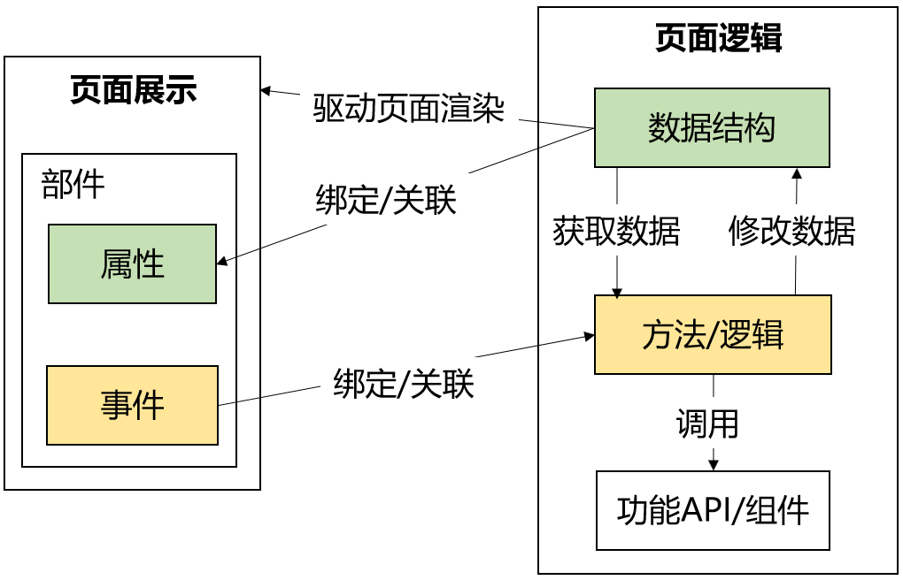

# 界面模型

文件名为 `{file_name}.ui.json`。

界面模型由三部分组成：

1. 程序模块基本信息 `resource`
2. 页面展示
   1. 页面模型 `uiModel`
   2. 页面实例 `view`
3. 页面逻辑
   1. 数据结构 `data`
   2. 处理逻辑 `methods`

**程序模块结构和关系图**


其中：

1. 页面展示
   1. 页面展示由 UI 部件组成
   2. 部件由属性和事件组成
2. 页面逻辑
   1. 数据结构
   2. 方法（调整数据和调用组件）
   3. 功能API/组件
3. 页面展示与页面逻辑关联
   1. 数据变化驱动页面重绘
   2. 部件属性与数据结构关联
   3. 部件事件与方法关联

## 结构

### `resource`

JSON 对象

### `uiModel`

JSON 数组

### `view`

JSON 数组

### `data`

JSON 数组

### `methods`

JSON 数组

## 示例

空页面

```json
{
    "resource": {},
    "uiModel": [],
    "view": [],
    "data": [],
    "methods": []
}
```
